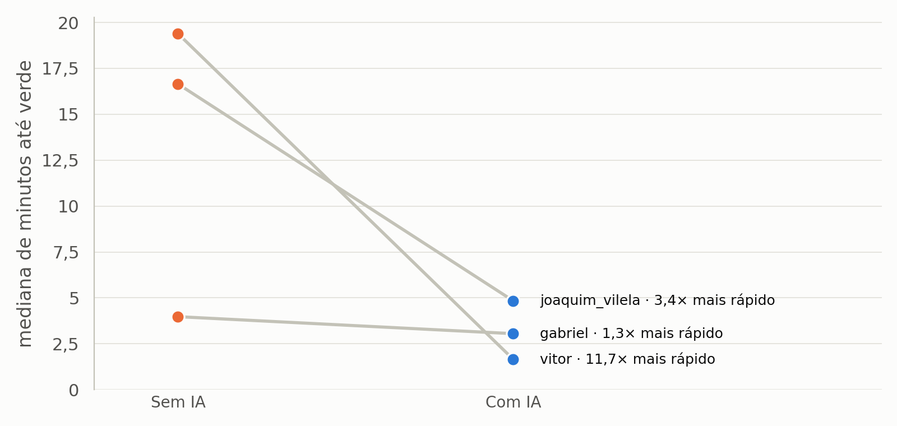
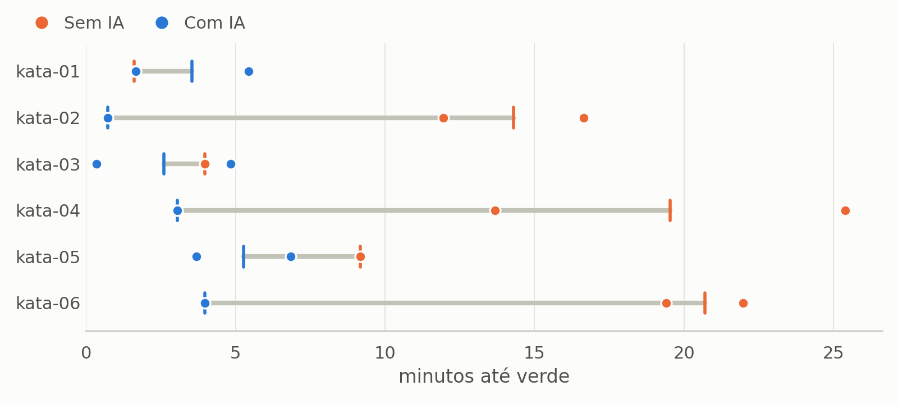
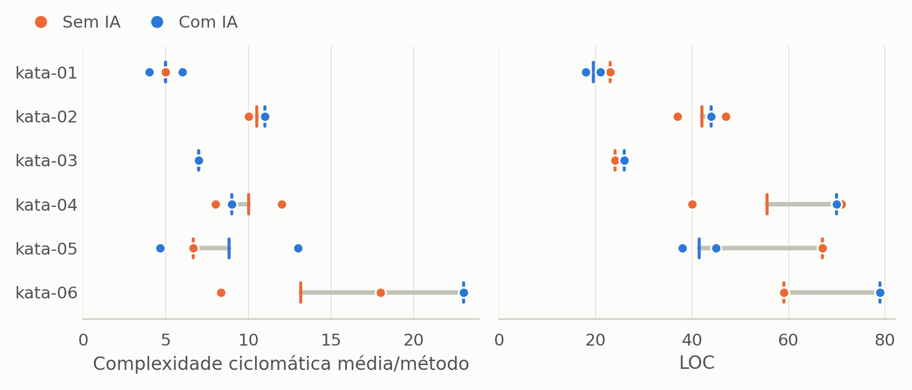

# Relatório de Laboratório

**Laboratório de Experimentação de Software**

| | |
|---|---|
| **Curso** | Engenharia de Software |
| **Disciplina** | Laboratório de Experimentação de Software |
| **Turno / Período** | Noite / 6º |
| **Professor(a)** | Danilo Maia |
| **Laboratório** | Lab02 — IA vs. codificação manual |
| **Grupo (trio)** | Joaquim Guilherme de Carvalho Vilela Silva · Vitor Costa Vianna · Gabriel Nogueira Vieira Resende |
| **Link do repositório / GitHub Projects** | https://github.com/lab-medicao-experimentacao/lab02-ia-vs-manual |
| **Data de entrega** | 24/09/2026 |

---

## 1. Introdução

Assistentes de IA baseados em modelos de linguagem se tornaram parte do fluxo diário de
programação, com a promessa de acelerar a escrita de código e reduzir defeitos. Falta,
porém, evidência **controlada** sobre o real impacto dessas ferramentas: quanto elas
aceleram a resolução de uma tarefa e a que custo em qualidade estrutural do código. Este
laboratório investiga esse impacto num experimento **crossover within-subject**, em que
três participantes resolvem seis katas de Java 21 sob time-box de 35 minutos — metade
**com** assistente de IA (Claude), metade **sem** — em ordem contrabalanceada.

Seguindo a abordagem **GQM**, o estudo responde às três Questões de Pesquisa do enunciado:

- **RQ1 — Tempo.** O uso de assistente de IA reduz o tempo necessário para resolver uma
  tarefa de programação?
- **RQ2 — Defeitos.** O uso de assistente de IA reduz a quantidade de defeitos (testes que
  falham) no código produzido?
- **RQ3 — Estrutura.** O uso de assistente de IA altera a complexidade ciclomática ou a
  duplicação do código produzido?

**Hipóteses (definidas antes da coleta), nula e alternativa por RQ:**

- **RQ1:** esperávamos que a IA **reduzisse** o tempo (hipótese direcional H1₁).
  H1₀: a IA não reduz o tempo.
- **RQ2:** esperávamos que a IA **reduzisse** os testes falhando (hipótese direcional H2₁).
  H2₀: a IA não reduz a proporção de testes falhando.
- **RQ3:** sem expectativa de direção — apenas verificar se **há diferença** estrutural
  (hipótese não direcional H3₁), com LOC como métrica de controle. H3₀: não há diferença
  de complexidade, duplicação ou LOC entre os tratamentos.

**Contribuições próprias do grupo (30% de inovação), detalhadas na Metodologia §3.6:**

- (a) **Métrica de tamanho de efeito** (rank-biserial pareado) além do p-valor exigido.
- (b) **Análise explícita da resolução do teste** para n = 3, mostrando o p-valor mínimo
  alcançável e suas consequências de interpretação.
- (c) **Infraestrutura própria de cronometragem e captura** em Docker (relógio monotônico,
  preservação de código no limite), garantindo comparabilidade entre trials.

## 2. Contexto

Este é o **Lab02** da disciplina, com desenho experimental controlado. Foi conduzido em três sprints: **S01** (desenho do experimento, seleção e
validação dos katas, ambiente e scripts), **S02** (execução dos 18 trials oficiais) e
**S03** (análise estatística, dashboard e este relatório).

O **objeto de estudo** é o processo de resolução de katas de programação, comparando dois
tratamentos: `com-ia` (Claude, Sonnet 5, esforço High, acessado pelo navegador; um
participante usou o Claude Code no terminal, ver §4.3) e
`sem-ia` (assistentes de IA desativados). Cada participante resolve os seis katas uma vez,
três por tratamento, sob time-box fixo de **35 minutos** por trial. Os katas são
**autorais e de baixa indexação**, para reduzir o risco de a IA reproduzir uma solução
memorizada em vez de auxiliar de fato.

**Objetos experimentais.** Os seis katas estão em `katas/kata-0N/`, cada um com enunciado
(`README.md`), código inicial e 8 testes de aceitação JUnit 5. A tabela resume o enunciado
e cita os trials de cada kata, com o tempo até verde. Os registros completos estão em
`results/<trial_id>/` (`trial.json`, código final e, nos trials com IA, `perguntas.md`).

| Kata | Nome | Enunciado (resumo) | Trials com IA | Trials sem IA |
|---|---|---|---|---|
| [kata-01](../katas/kata-01/README.md) | Normalizador de Etiquetas | `TagNormalizer.normalize`: separar etiquetas por vírgula, aparar, converter para minúsculas, colapsar espaços internos, descartar vazias e remover duplicatas preservando a primeira ocorrência | Joaquim (326,5 s), Vitor (99,6 s) | Gabriel (96,1 s) |
| [kata-02](../katas/kata-02/README.md) | Agrupador de Extrato | `LedgerGrouper.group`: somar lançamentos `categoria:valor` por categoria, ignorar entradas inválidas e ordenar por total decrescente, com desempate alfabético | Gabriel (43,3 s) | Joaquim (999,1 s), Vitor (717,5 s) |
| [kata-03](../katas/kata-03/README.md) | Compressor de Corridas | `RunCompressor.compress`: run-length com regra própria, em que corridas de tamanho 1 ficam sem contagem (`"aaabccccd"` → `"3ab4cd"`) | Joaquim (290,7 s), Vitor (21,2 s) | Gabriel (238,7 s) |
| [kata-04](../katas/kata-04/README.md) | Validador de Agenda | `ScheduleValidator.conflicts`: detectar pares de reuniões `nome HH:MM-HH:MM` sobrepostas (fim exclusivo), com pares e lista em ordem alfabética | Gabriel (183,2 s) | Joaquim (820,4 s), Vitor (1523,7 s) |
| [kata-05](../katas/kata-05/README.md) | Mascarador de Contatos | `ContactMasker.mask`: validar e mascarar contatos `tipo:valor` (e-mail → `a***@dominio`; telefone → só os 4 últimos dígitos), descartando inválidos | Joaquim (221,9 s), Vitor (410,8 s) | Gabriel (550,5 s) |
| [kata-06](../katas/kata-06/README.md) | Encadeador de Trechos | `RouteChainer.chain`: encadear trechos `origem-destino` em itinerários, descartando ramificações, convergências e ciclos, com ordenação pela cidade inicial | Gabriel (238,3 s) | Joaquim (1318,9 s), Vitor (1163,7 s) |

**Base conceitual:** o método **GQM** (Basili, Caldiera & Rombach) estrutura a ligação
entre objetivo, questões (RQ1–RQ3) e métricas; a complexidade ciclomática segue a
definição de **McCabe**; a análise estatística usa o teste **de Wilcoxon dos postos
sinalizados** para amostras pareadas, coerente com o desenho within-subject.

## 3. Metodologia

### 3.1 Participantes e desenho

Três participantes resolveram seis katas cada, metade com IA e metade sem IA,
totalizando **18 trials** em um desenho *within-subject*. Cada pessoa foi comparada
consigo mesma. A distribuição e a ordem observadas nos registros foram:

- **Um participante:** K1–K6 em sequência, alternando sem IA nos ímpares e com IA nos pares.
- **Dois participantes:** K1, K3 e K5 com IA, seguidos de K2, K4 e K6 sem IA.

Cada kata teve ambos os tratamentos, na proporção 2:1. A alternância planejada não
foi integralmente cumprida; efeitos de ordem e aprendizado não foram completamente
controlados.

### 3.2 Katas

Os seis exercícios autorais foram considerados comparáveis por exigirem lógica,
strings e coleções, poucas regras e soluções compatíveis com 35 minutos, sem
frameworks ou algoritmos especializados. Cada módulo possuía **oito testes JUnit
de aceitação**, visíveis desde o início, iguais para todos e sem permissão de alteração.

| Kata | Exercício | Conteúdo principal |
|---|---|---|
| K1 | Normalizador de Etiquetas | Normalização e deduplicação de strings |
| K2 | Agrupador de Extrato | Agregação por chave e ordenação |
| K3 | Compressor de Corridas | Codificação de sequências consecutivas |
| K4 | Validador de Agenda | Horários e sobreposição de intervalos |
| K5 | Mascarador de Contatos | Validação e mascaramento de strings |
| K6 | Encadeador de Trechos | Encadeamento e detecção de ciclos |

### 3.3 Ambiente

Docker Compose padronizou a execução da compilação, dos testes e da coleta. As
ferramentas e bibliotecas utilizadas foram:

- **Linguagens:** Java 21 (Temurin 21.0.7) para os katas e Python 3.12.11 para os scripts.
- **Compilação e testes:** Maven 3.9.9, JUnit 5.13.4 e Surefire 3.5.4.
- **Métricas estáticas:** PMD/CPD 7.17.0 para complexidade e duplicação; script próprio para LOC.
- **Análise de dados:** pandas 2.2.3, NumPy 2.1.3 e SciPy 1.14.1.
- **Visualização:** Matplotlib 3.9.2 e Seaborn 0.13.2.
- **IDE:** livre escolha

### 3.4 Assistente de IA

Foi utilizado **Claude**, com modelo e configuração declarados pelo grupo como
**Sonnet 5, esforço High**. O protocolo previa acesso pelo navegador, nova conversa
por trial e prompt inicial padronizado, seguido de interação livre. Os registros de
um participante documentam Claude Code pelo terminal, inclusive com edição direta
dos arquivos; portanto, a interface de acesso não foi uniforme.

As solicitações foram resumidas em `perguntas.md`. No tratamento sem IA, os
assistentes ficaram desativados. Documentação, fóruns e tutoriais eram permitidos
nos dois tratamentos, mas consultas a soluções específicas dos katas eram proibidas.

### 3.5 Procedimento

1. **Preparação:** baixar dependências e validar o ambiente offline com `prepare.py`.
   O protocolo previa familiarização com o módulo `smoke`, fora da amostra.
2. **Início:** executar `trial.py start`, que iniciava o relógio monotônico e exibia
   o enunciado. Leitura, implementação e testes integravam os **35 minutos**.
3. **Testes:** pressionar Enter no terminal para executar a suíte sobre uma cópia
   da solução. O tempo até verde era registrado ao concluir todos os testes com sucesso.
4. **Encerramento:** concluir no sucesso dentro do prazo ou ao atingir o limite.
   No limite, a edição deveria cessar e o código era preservado para avaliação final;
   sucesso posterior não contava como conclusão no prazo.

### 3.6 Coleta

A coleta reuniu três dimensões, com métricas estruturais calculadas apenas sobre o
código final da solução, excluindo testes e infraestrutura:

- **Tempo:** tempo até verde e estado da tentativa.
- **Qualidade funcional:** testes passando e falhando, incluindo erros, e taxa de sucesso.
- **Estrutura:** complexidade ciclomática média por método (PMD, `methodReportLevel=1`),
  duplicação (CPD, mínimo de 50 tokens) e LOC, sem linhas vazias ou apenas comentários.
  A duplicação corresponde às linhas de código duplicadas, sem contar sobreposições,
  divididas pelo LOC total.

Cada trial preservou `trial.json`, `environment.json`, código final e `metrics.json`
em pasta própria. O comando `trial.py export` reuniu os trials oficiais em
`results/consolidado.csv`, base para as análises e o dashboard.

### 3.7 Análise

A descritiva utilizou **mediana e IQR por tratamento**. Para inferência, os três trials
de cada participante e tratamento foram agregados pela mediana, formando **três pares**.
Aplicou-se Wilcoxon pareado exato, com α = 0,05: unilateral para redução de tempo e
defeitos, bilateral para métricas estruturais. O tamanho de efeito rank-biserial
complementou os p-valores.

O tratamento dos dados seguiu os critérios abaixo:

- **Diferenças nulas:** removidas do Wilcoxon; se todas fossem zero, o teste seria não aplicável.
- **Outliers:** identificados pela regra de Tukey (1,5 × IQR) e mantidos por serem plausíveis.
- **Dados ausentes e ocorrências técnicas:** sem imputação de zero; registros técnicos
  separados das comparações e dados ausentes excluídos da métrica correspondente.
- **Censura:** reportada separadamente, sem converter o limite em tempo de conclusão.
  O protocolo previa suspender o teste de tempo se a censura afetasse os pares;
  avaliações finais e métricas válidas continuariam elegíveis para RQ2 e RQ3.

A interpretação permaneceu exploratória, dado o número reduzido de participantes.

## 4. Resultados

### 4.1 Coleta de Dados

Foram concluídos os **18 trials oficiais** planejados (3 participantes × 6 katas, 9 por
tratamento). **Todos** terminaram com estado `completed`, dentro do time-box de 35 min —
nenhum censurado (esgotamento do tempo) e nenhum interrompido por ocorrência técnica.
Todos os 18 trials passaram **8/8** testes de aceitação. As métricas estruturais foram
coletadas para os 18 trials sobre o código final preservado.

**Estatística descritiva por tratamento** (9 trials cada; mediana e IQR, conforme o
enunciado; detalhes em `doc/descritiva.md`):

| RQ | Métrica | Tratamento | Mediana | Q1 | Q3 | IQR |
|---|---|---|---:|---:|---:|---:|
| RQ1 | Tempo até verde (s) | sem-ia | 820,4 | 550,5 | 1163,7 | 613,2 |
| RQ1 | Tempo até verde (s) | com-ia | 221,9 | 99,6 | 290,7 | 191,1 |
| RQ2 | Testes falhando (nº) | sem-ia | 0 | 0 | 0 | 0 |
| RQ2 | Testes falhando (nº) | com-ia | 0 | 0 | 0 | 0 |
| RQ3 | Complexidade média/método | sem-ia | 8,33 | 7 | 11 | 4 |
| RQ3 | Complexidade média/método | com-ia | 7 | 6 | 11 | 5 |
| RQ3 | Duplicação (%) | sem-ia | 0 | 0 | 0 | 0 |
| RQ3 | Duplicação (%) | com-ia | 0 | 0 | 0 | 0 |
| RQ3 | LOC (controle) | sem-ia | 47 | 37 | 59 | 22 |
| RQ3 | LOC (controle) | com-ia | 38 | 26 | 45 | 19 |

**Outliers.** Pela regra de Tukey (1.5×IQR), foram identificados **3 outliers**, todos no
**kata-06** (o mais complexo, com detecção de ciclo): complexidade de 18 (Joaquim, sem-ia)
e 23 (Gabriel, com-ia) e LOC de 79 (Gabriel, com-ia). São valores plausíveis do problema,
não erros de medição; foram **mantidos**, sem descarte (documentado em `doc/outliers.md`).

### 4.2 Visualização Gráfica

Os gráficos abaixo são gerados por `scripts/dashboard.py` (dashboard completo em
`doc/dashboard/index.html`). Como há n pequeno e distribuição assimétrica, usa-se
**mediana** como tendência central.

**RQ1 — O uso de IA reduz o tempo de resolução?**

Pontos conectados (before/after) por participante: os três reduzem o tempo com IA. As
medianas por participante caem de 238,7 → 183,2 s (Gabriel), 999,1 → 290,7 s (Joaquim) e
1163,7 → 99,6 s (Vitor).

Por kata, os maiores ganhos com IA aparecem no kata-02, no kata-04 e no kata-06, com
diferenças de ≈815 s a ≈1000 s nas medianas (kata-02: ~43 s com IA contra ~858 s sem IA;
kata-04: ~183 s contra ~1172 s; kata-06: ~238 s contra ~1241 s). Nesses katas, porém, o
lado com IA tem um único trial (Gabriel), então a comparação por kata mistura o efeito do
kata com o do participante e deve ser lida como descritiva. No kata-01, o mais curto, o
tempo com IA foi maior (mediana de ~213 s contra ~96 s sem IA).

**RQ2 — O uso de IA reduz os defeitos?**

Não há variação a exibir em defeitos: a **taxa de sucesso foi 100% (8/8) em todos os 18
trials**, nos dois tratamentos, por isso não há gráfico para RQ2 (o dashboard mostra uma
nota no lugar do gráfico vazio).

**RQ3 — O uso de IA altera a estrutura do código?**

Complexidade e LOC não têm direção consistente entre tratamentos; a duplicação é 0% em
todos os trials.

### 4.3 Discussão

**Respostas estatísticas por RQ** (Wilcoxon pareado sobre as medianas de cada
participante, n = 3 pares; detalhes em `doc/rq1-rq2.md` e `doc/rq3.md`):

| RQ | Métrica | Pares efetivos | Mediana das dif. (com − sem) | W | p | r (rank-biserial) | Decisão |
|---|---|---:|---:|---:|---:|---:|---|
| RQ1 | Tempo até verde (s) | 3 | −708,4 | 0 | 0,125 (unilateral) | −1,00 | Não rejeita H1₀ |
| RQ2 | Testes falhando | 0 | 0 | — | — | — | Teste não aplicável (sem variação) |
| RQ3a | Complexidade média/método | 3 | −4,00 | 2 | 0,75 (bilateral) | −0,33 | Não rejeita H3₀ |
| RQ3b | Duplicação (%) | 0 | 0 | — | — | — | Teste não aplicável (sem variação) |
| RQ3c | LOC (controle) | 3 | −14 | 3 | 1,00 (bilateral) | 0,00 | Não rejeita H3₀ |

**RQ1 — Tempo. Hipótese apoiada pela direção dos dados, sem significância estatística.** Os três participantes foram mais
rápidos com IA (diferenças de −55,6 s, −708,4 s e −1064,1 s; mediana −708 s), com direção
100% consistente e tamanho de efeito máximo (rank-biserial = −1,00). O **Wilcoxon pareado
unilateral** deu **W = 0, p = 0,125** — não significativo a α = 0,05. Em linguagem
acessível: *todos* melhoraram com IA e na maior intensidade que o teste consegue captar,
mas com três participantes o p-valor não consegue descer abaixo de 0,125, então a
tendência é **forte e uniforme, porém não confirmável estatisticamente**. A hipótese H1₁
é apoiada pela direção dos dados, sem significância formal.

**RQ2 — Defeitos. Hipótese não testável.** Como todos os trials atingiram 8/8, as
diferenças pareadas são zero e o teste não se aplica. A qualidade funcional foi **máxima**
nos dois tratamentos dentro do time-box; a diferença entre tratar com ou sem IA apareceu
no **tempo** (RQ1), não no acerto final. Não confirma nem refuta H2₁ — a métrica não
discrimina com estes katas.

Olhando o caminho até o verde, e não só o resultado final, surge uma diferença. Os
`trial.json` registram cada execução dos testes. Os **9 trials com IA passaram na primeira
execução**. Sem IA, o Gabriel também passou de primeira nos três katas, mas o Joaquim
precisou de 2, 3 e 5 execuções e o Vitor de 3, 5 e 7. Foram 19 execuções intermediárias
sem sucesso: 17 com testes falhando (até 7 de 8) e 2 com erro de compilação. Isso sugere
que a IA reduz os defeitos *durante* a resolução, embora não no código final. É uma
leitura exploratória, fora da métrica planejada para RQ2 e sem teste estatístico.

**RQ3 — Estrutura. Sem diferença consistente.** Complexidade caiu com IA para dois
participantes e subiu para um (p = 0,75); LOC seguiu o mesmo padrão (p = 1,00); duplicação
foi 0% em todos. A variação estrutural reflete mais o estilo/tamanho da solução de cada
participante do que o tratamento. Não se rejeita H3₀ — lembrando que, com n = 3, "sem
diferença detectável" **não** equivale a "equivalência comprovada".

**Interação com a IA (análise qualitativa dos `perguntas.md`).** Ao fim de cada trial com
IA, o participante registrou um resumo das perguntas feitas ao assistente
(`results/<trial_id>/perguntas.md`). Os nove resumos mostram três estilos de uso:

- **Gabriel: enunciado completo, IA como solucionadora.** No kata-02, o Claude pediu a
  assinatura e o código atual e entregou a implementação completa, verde em 43 s. Nos
  katas 04 e 06, as perguntas foram sobre regras e casos-limite (bordas de intervalos,
  formato `HH:MM`, reuniões em vários conflitos) ou sobre a estrutura da solução. No
  kata-06, o Claude modelou o problema como um grafo com grau máximo 1 e propôs um
  algoritmo em quatro passos.
- **Joaquim: IA guiada passo a passo.** De 4 a 5 instruções por kata, cada uma
  correspondendo a uma etapa da implementação: criar a lista de resultado, tratar `null`
  e vazio, montar o laço e aplicar as regras. O participante decompôs o problema e a IA
  produziu cada parte.
- **Vitor: abordagem proposta pela IA, aprovada e escrita direto no arquivo** (Claude
  Code no terminal). Nos katas 01 e 03 houve um único ciclo: a IA propôs, o participante
  aprovou e a IA escreveu, com 99,6 s e 21,2 s até o verde. No kata-05, o participante
  discutiu cerca de sete decisões de desenho antes de pedir o código (corte no primeiro
  `:`, `split("@", -1)`, métodos auxiliares), e o tempo subiu para 410,8 s.

Em todos os estilos, a IA acertou as regras na primeira tentativa, o que é coerente com
as execuções de teste únicas vistas em RQ2. O tempo com IA dependeu mais de quanto o
participante deliberou do que da dificuldade do kata. O trial mais longo com IA (Vitor,
kata-05) foi o de mais interações, e o mais curto (Vitor, kata-03, 21 s) foi o de uma
só. O Joaquim registrou um incidente operacional no kata-05: no início da interação o
kata foi tratado como kata-06, e uma alteração provisória no arquivo do kata-06 foi
revertida antes da execução dos testes, sem efeito no código avaliado.

**Ameaças à validade.** (i) *Poder estatístico* — dominante: n = 3 impede significância a
5% (inovação (b)); conclusões exploratórias. (ii) *Efeito de aprendizado e confusão
tratamento/participante* — o contrabalanceamento 2:1 faz o tratamento coincidir com o
participante dentro de cada kata. (iii) *Memorização pela IA* — mitigada por katas
autorais; o ganho concentrado nos katas difíceis é compatível com auxílio genuíno. (iv)
*Exposição de quem preparou os katas* — Gabriel, autor dos katas, foi justamente o de
menor ganho com IA e maior complexidade/LOC com IA, o que deve ser considerado. Ele
também foi o único a passar de primeira nos trials sem IA. (v) *Interface da IA não
uniforme* — o protocolo previa o Claude pelo navegador, mas o Vitor usou o Claude Code
no terminal, que escreve o código direto no arquivo. O modelo e o esforço são os mesmos
(Sonnet 5, High), mas a interface elimina o tempo de copiar e colar, o que pode ter
favorecido os tempos dele com IA (a mediana mais baixa do grupo, 99,6 s). (vi)
*Registro de tempo* — no trial `A_kata-05_semia` (Gabriel), o tempo gravado é 550,5 s,
mas o intervalo entre `started_at` e `ended_at` é de 693,5 s. Usamos o valor gravado,
como nos demais trials; com qualquer um dos dois, esse é o maior tempo sem IA do Gabriel,
então a mediana dele (238,7 s) e os resultados de RQ1 não mudam.

**Contribuição das inovações (§3.6).** O tamanho de efeito (a) foi decisivo para mostrar
que RQ1, apesar do p não significativo, tem efeito consistente e máximo; a análise de
resolução do teste (b) explicou *por que* nenhum p seria significativo, evitando a leitura
equivocada de "IA não faz diferença"; a infraestrutura de cronometragem (c) sustenta a
confiabilidade dos tempos que embasam o achado de RQ1.

## 5. Conclusão

O experimento sugere que o assistente de IA **reduz o tempo** de resolução de katas de
Java sob time-box, de forma consistente entre os três participantes (com os maiores
ganhos descritivos nos katas 02, 04 e 06), **sem degradar** a corretude funcional (todos os trials chegaram
a 8/8) e **sem diferença estrutural detectável** (complexidade, duplicação e LOC sem
direção consistente). Não observamos o trade-off "mais rápido, porém pior" — o que, com
n = 3, não equivale a demonstrar que ele não existe. De forma exploratória, a IA também
reduziu as tentativas até o verde: todos os trials com IA passaram na primeira execução
dos testes. Os registros de interação (`perguntas.md`) mostram que isso ocorreu com
estilos de uso bem diferentes entre os participantes.

A principal **limitação** é o tamanho amostral: com três participantes, o teste de
Wilcoxon não alcança significância a 5% em nenhuma RQ (o p mínimo é 0,125 nos testes
unilaterais de RQ1/RQ2 e 0,25 nos bilaterais de RQ3), de modo que
todos os achados são **exploratórios**. Somam-se as ameaças de contrabalanceamento
incompleto (2:1), possível memorização pela IA, interface da IA não uniforme (navegador
versus Claude Code) e a exposição do integrante que preparou os
katas.

**O que faríamos diferente com mais tempo/recursos:** ampliar substancialmente o número de
participantes (ou de réplicas independentes por condição) para obter poder estatístico
real; usar katas maiores, em que duplicação e complexidade tenham variância suficiente
para discriminar; e adotar métricas de qualidade mais sensíveis que a contagem de testes
verdes. Entre as inovações (§3.6), o **tamanho de efeito** e a **análise de poder para n
pequeno** são as que mais valeria expandir — juntas, permitem interpretar corretamente
experimentos com amostras reduzidas, comuns em estudos com participantes humanos.

## Referências

- BASILI, V. R.; CALDIERA, G.; ROMBACH, H. D. *The Goal Question Metric Approach.* 1994.
- McCABE, T. J. *A Complexity Measure.* IEEE Transactions on Software Engineering, 1976.
- WILCOXON, F. *Individual Comparisons by Ranking Methods.* Biometrics Bulletin, v. 1,
  n. 6, p. 80–83, 1945.
- PMD. *PMD Source Code Analyzer — CyclomaticComplexity e CPD (v7).* https://pmd.github.io/
